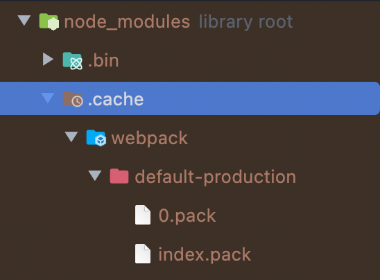

# 들어가며

프로젝트 규모가 커질 수록 빌드 시간이 증가했던 경험을 해보신 적 있으신가요? 빌드 시간이 증가하면 개발 및 배포 과정에서 시간이 많이 소요 되며, 이로 인해 개발자들의 생산성을 낮추는 스트레스를 요인이 되곤 합니다. 이 글에서는 누군가, 혹은 과거의 내가 작성했던 웹팩 설정 코드를 개선하여 웹팩 빌드 시간을 줄일 수 있는 방법을 살펴보겠습니다.

</br>

# 빌드 시간 측정 하기

웹팩으로 프로젝트를 빌드했을 때 빌드 완료까지 걸린 시간을 확인 할 수 있습니다.

이때 빌드 시간 뿐만 아니라 config에 적용된 로더(loader)와 플러그인(plugin)의 실행시간을 분석할 수 있다면 빌드 시간 증가에 영향을 미치는 요인을 확인해볼 수 있을텐데요. speed-measure-webpack-plugin은 웹팩 빌드 시간을 측정하고, 각 로더 및 플러그인의 실행 시간을 분석할 수 있는 플러그인 입니다.

## 적용 방법

1. speed-measure-webpack-plugin 을 dev dependency로 설치해줍니다.

```bash
npm install --save-dev speed-measure-webpack-plugin
```

2. webpack config 파일에 'speed-measure-webpack-plugin'을 불러옵니다.

```js
const SpeedMeasurePlugin = require('speed-measure-webpack-plugin')
```

3. `SpeedMeasurePlugin`의 객체를 생성해준 뒤 `wrap` 메서드로 config 객체를 감싸서 내보냅니다.

```js
const smp = new SpeedMeasurePlugin()

module.exports = smp.wrap({
  // ...
})

module.exports = smp.wrap(config)
```

## 결과

전체 빌드 시간뿐만 아니라 각 로더, 플러그인 별 실행 시간을 확인해볼 수 있습니다.

# 빌드 최적화

그럼, 빌드 최적화를 위해 확인해보면 좋을 몇 가지 사항들에 대해 살펴보겠습니다.

## 로더, 플러그인 제대로 적용하기

로더(loader)는 웹팩이 모듈로 로드할 때, 해당 모듈의 소스 코드를 변환합니다. 로더에는 ES6 문법으로 작성된 코드를 ES5 형태로 변환하는 Babel 로더나, SCSS 파일을 CSS 형태로 변환하는 sass-loader 등이 있습니다. 즉, 로더는 웹팩이 모듈을 해석하고 변환하기 위해 사용하는 기능입니다.

반면, 플러그인(plugin)은 번들링 된 결과물에 대한 추가적인 작업을 수행합니다. 플러그인에는 번들링된 결과물의 용량을 줄이기 위해 코드 난독화를 수행하는 Terser 플러그인, CSS 파일을 별도의 파일로 추출하기 위해 MiniCssExtractPlugin 등이 있습니다.

### 필수 로더, 플러그인만 적용하기

현재 개선 중인 프로젝트에는 초기 개발 시 목적 없이 적용 되었거나 동일한 기술 스택을 사용 중인 타 프로젝트의 보일러 플레이트를 그대로 적용한 설정을이 있었습니다. 예를 들어 해당 프로젝트 내에는 스타일 관련 소스가 존재하지 않음에도 CSS 관련 로더가 존재했으며, 바벨의 프리셋(preset)과 플러그인에는 프로젝트 특성과 맞지 않는 설정 값이 적용되기도 했습니다.

웹팩 공식 문서에서도 바벨 프리셋과 플러그인 수를 최소화하는 것을 강조하고 있습니다. 기존에 작성된 로더와 플러그인을 점검하여 불필요한 요소를 제거 해보시길 바랍니다.

### 로더 사용 범위 제한하기

바벨 로더를 적용할 경우 아래와 같이 로더를 적용할 파일 형식과 사용할 로더만 명시할 수도 있지만,

```js
module.exports = {
  //...
  module: {
    rules: [
      {
        test: /\.js$/,
        loader: 'babel-loader',
      },
    ],
  },
}
```

`include` 필드를 사용하여 실제로 변환해야 하는 최소한의 모듈에만 로더를 적용할 수도 있습니다.

```js
const path = require('path')

module.exports = {
  //...
  module: {
    rules: [
      {
        test: /\.js$/,
        include: path.resolve(__dirname, 'src'),
        loader: 'babel-loader',
      },
    ],
  },
}
```

## 최적화는 상용(production) 환경에서

상용 환경에서는 초기 렌더링 시간을 빠르게 하기 위해 번들 크기를 줄이거나 내부 코드 유출을 방지하기 위해 코드를 난독화 하는 등의 최적화 작업이 필요합니다. 최적화 작업은 비용이 큰 작업들이 많기 때문에 이러한 최적화 작업이 개발 환경에서도 진행 된다면, 빌드 혹은 수정 사항을 리빌드(rebuild)하는 시간이 불필요하게 증가할 수 있습니다. 따라서 빌드 환경에 따라 최적화 방법도 다르게 적용되어야 합니다.
웹팩에서 자주 사용되는 최적화 관련 플러그인에는 Terser 플러그인과 SplitChunks 플러그인에 대해 살펴보겠습니다.

### Terser 플러그인

Terser 플러그인 프로덕션 환경에서 코드를 난독화하고, 압축하여 번들 크기를 줄일 수 있으나, 사용 시 빌드 시간이 길어질 수 있습니다. 따라서 개발 환경에서는 TerserPlugin을 비활성화하거나, optimization.minimize 설정을 false로 적용 해야 합니다.

### SplitChunks 플러그인

splitChunks 플러그인은 공통 모듈을 분리하고, 불필요한 중복 코드를 제거하여 번들 크기를 줄일 수 있는 기능을 제공합니다. splitChunks 플러그인 역시 코드를 분석하고 복잡한 계산을 수행하기 때문에 개발 환경에서 사용한다면 빌드 시간에 영향을 미칩니다. splitChunks 플러그인 역시 프로덕션 모드에서 사용하고, 개발 환경에서는 적절한 설정을 통해 빌드 속도를 개선하는 것이 좋습니다.

## 적용한 소스맵(source-map) 확인하기

웹팩 빌드시 소스맵(source-map)을 적용하면 빌드된 코드와 실제 코드 간의 매핑을 제공해주어 디버깅에 도움이 됩니다. 상용 빌드에는 소스맵을 쓰지 않는 것이 성능상 가장 좋지만, 디버깅을 위해 사용한다면 적절한 소스맵 옵션을 선택하여 빌드 시간을 단축하면서도 디버깅을 용이하게 해야합니다.

### 개발 환경에서의 소스맵

- cheap-module-source-map : 번들링된 파일의 소스맵 정보를 제공하는데, 디버깅 정보만 제공하므로 속도가 빠릅니다.

### 상용 환경에서의 소스맵

> 상용 환경에서 소스맵을 사용할 경우, 일반 사용자가 소스맵 파일에 접근 할 수 없도록 서버를 구성하고, 소스맵 파일을 웹 서버에 배포하면 안 됩니다.

- source-map: 전체 소스맵을 별도의 파일로 내보냅니다. 번들에 참조 주석을 추가하여 개발 도구에서 찾을 수 있도록 합니다.
- hidden-source-map: source-map과 동일하지만 번들에 참조 주석을 추가하지 않습니다. 오류 보고서의 오류 스텍 추적에만 소스맵을 매핑하고 브라우저 개발 도구에는 소스맵을 노출하지 않는 경우에 유용합니다.

더 많은 소스맵 종류는 [이곳](https://webpack.kr/configuration/devtool/#development)에서 살펴보시길 바랍니다.

## Persistent cache 사용하기

Webpack 4에서는 cache-loader나 hard-source-webpack-plugin 등과 같은 캐시 관련 로더와 플러그인을 사용하여 빌드 속도를 개선할 수 있었습니다. 하지만 이러한 방법은 캐시를 파일 시스템에 저장하는 것이 아니라 메모리 상에 저장하는 방식이기 때문에, PC를 종료하거나 Webpack을 다시 실행할 때마다 캐시를 재생성해야 합니다.

Webpack 5에서 추가된 Persistent Cache를 사용하면, 파일 시스템에 캐시를 저장하기 때문에 PC를 종료하거나 Webpack을 다시 실행해도 캐시를 유지할 수 있기에 빌드 속도를 높일 수 있습니다. 캐시를 통해 이미 빌드된 라이브러리를 리빌드하지 않고 재사용할 수 있기에 빌드 시간을 단축할 수 있습니다.

실제 적용해본 결과, 첫 번째 빌드는 시간이 다소 증가하였지만 두 번째 빌드 부터는 빌드 시간이 절반 가량 단축된 결과를 확인할 수 있었습니다.

### 적용 방법

```js
module.exports = {
  cache: {
    type: 'filesystem',
    allowCollectingMemory: true,
  },
}
```

### 캐시 저장 살펴보기

웹팩의 Persistent Cache는 node_modules/.cache/webpack 내에 생성되는 것을 확인할 수 있습니다.


# 마치며

웹팩 빌드 시간 단축을 위해 고려해야하는 대표적인 개념들을 살펴보았습니다. 글에서 언급한 개념 외에도 자바스크립트 번들러로 babel-loader보다 처리 속도가 빠른 esbuild-loder를 도입해본다던지, vite, esbuild 등의 번들러로 마이그레이션하여 속도 개선을 해보는 것도 좋은 선택일 수 있을 것 입니다.

# 참고

- [Webpack 공식 문서 - Build Performance](https://webpack.kr/guides/build-performance)
- [Webpack 공식 문서 - Cache](https://webpack.js.org/configuration/cache)
- [Webpack 공식 문서 - Devtool](https://webpack.kr/configuration/devtool)
